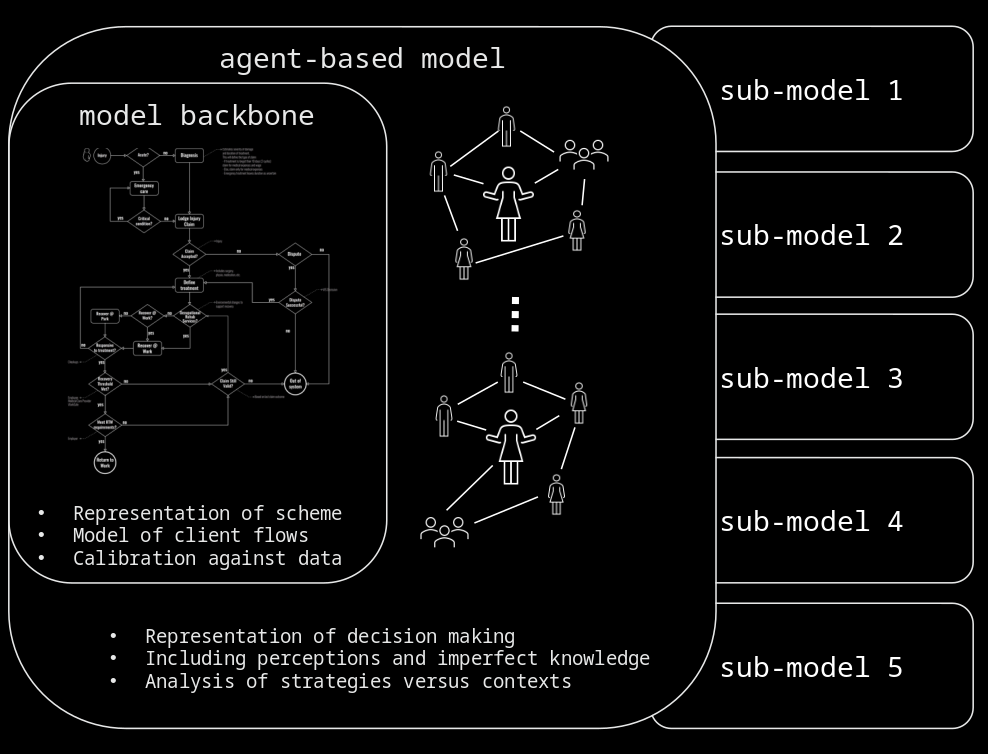
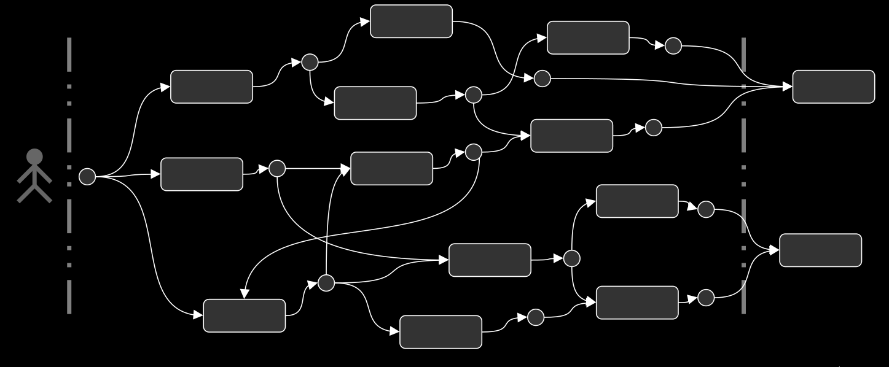

GENSIMO
=======

**GENeric Social Insurance MOdelling**, GENSIMO for short, is a modelling framework written in Julia for the representation, analysis and simulation of social insurance systems.

```@raw html

```
Figure 1. _Gensimo framework with the MDP backbone and sub-models for deliberative processes._


## Modelling Social Insurance Systems ##

The GENSIMO framework models the dynamics of clients interacting with a particular insurance scheme. Over time, a client may receive several _services_ -- typically compensation payments -- which are tallied up administratively as part of the client's _claim_. Some services are granted without much scrutiny, whereas some _service requests_ involve a deliberation between the insurer and the client. In some cases, external parties such as lawyers or medical professionals may be engaged in these deliberations.

These dynamics are represented in the GENSIMO framework as a succession of client _states_ interspersed by _deliberative processes_, where each successive state is the outcome of such a process. This leads to a picture like in Figure 1. With an appropriate notion of 'state', the client-scheme dynamics can then be formalised as a Markov Decision Process (MDP, see e.g. <https://en.wikipedia.org/wiki/Markov_decision_process>). An MDP has a state space and an action space -- containing all possible states and actions, respectively. The actions in GENSIMO correspond to models of a deliberative process and, in principle, a completely different model can be used for each action.

```@raw html

```
Figure 2. _Client pathway from the GENSIMO perspective._

Which state is followed by which action is dictated by the _policy_. Typically MDPs are used to find some form of _optimal_ policy, for example, using Dynamic Programming or Reinforcement Learning algorithms. Though this could be done in the GENSIMO framework, it is not the default approach. Rather, the policy represents the settings of the scheme -- that is, the settings of the _modelled_ version of the scheme.

## Data-Based Backbone ##

If data are available on clients' state transitions, then one can, in principle, distill the transition probabilities. That is, given that a client is in some known state ``s``, what is the probability distribution over the possible next states ``s'``. This would specify a Markov chain for the client trajectories and a Markov chain. Note that a Markov chain is essentially a Markov Decision Process where the policy is fixed, i.e. there is always just one choice of action. What this 'action' is, one does not know, all that is known is the probabilities of the future states that result from this implicit action.

While this may not sound very illuminating, it is in fact a great asset. If the deliberative processes are represented in separate little models (as is the intention of the framework) with a policy modelling the real dynamics (as opposed to some future scenario, for example), then one can straightforwardly _compare_ the modelled processes with the data by sampling client pathways from the data-based Markov chain and the MDP with modelled deliberative processes. In this fashion, each little model of a deliberative process becomes a quantitatively testable hypothesis.

## Deliberative Processes as Plug-in Modules ##

The process of approving or denying a client service request may be simple and automatic (e.g. for small, routine services) or it may be protracted, involving several iterations and multiple actors in addition to the client and the insurer (e.g. medical assessors, lawyers). Consequently, various types of deliberation need to be available in the modelling framework. More precisely, depending on the client's state and the policy (i.e.\ which _action_ is triggered, given the client's state), a sub-model needs to be instantiated to match the situation.

By facilitating the use of custom and potentially many different sub-models for deliberative processes, the user can set up a policy to (1) mimic the real dynamics as closely as possible, (2) try out candidate improvements to the actual processes, (3) experiment with changes to the scheme or external legislation more broadly, amongst many other options. The intention is to have a portfolio of deliberative process models available as part of Gensimo (under construction) while users can add their own models if desired.

Several theoretical and methodological principles can be used and mixed. At the time of writing, agent-based social simulation models as well as (iterated) games are being considered and developed. The outcome of a deliberative process is a new state of the client in question. This means the list of received services is updated if a request is approved, any changes to physical and mental health are recorded etc. Any changes to systemic and aggregate variables are updated after a deliberative process as well. This is done by the conductor module, see below.

## Model Core -- Conductor Module ##

Even though the MDP and the deliberative process plug-ins constitute the basis of Gensimo simulations, there are several considerations that warrant a central module -- we call it the _conductor_ -- in control of it all:

* Keeping time. The state changes do not, intrinsically, have a notion of time. There is just before and after. Clearly, in reality the timing of service requests is of considerable importance. Thus, the conductor needs to keep time and moreover it indicates 'when' state changes ought to occur, i.e. it issues time stamps to states.
* Keeping score. An MDP is, in essence, without a state. This is in itself not problematic at all, indeed perhaps desirable. However, one typically wants simulations to yield a bundle of client pathways which means the states and their timestamps need to be collected somewhere. Thus, the conductor keeps the score.
* System-level and aggregate variables. Various quantities of interest are not tied to any particular client, let alone a particular client state. Think of, overall cost of the scheme, labour time by insurance personnel handling client requests, cumulative waiting times and so on.

In addition to the above, the conductor module is also the normal entry point for any simulation including batch runs.
